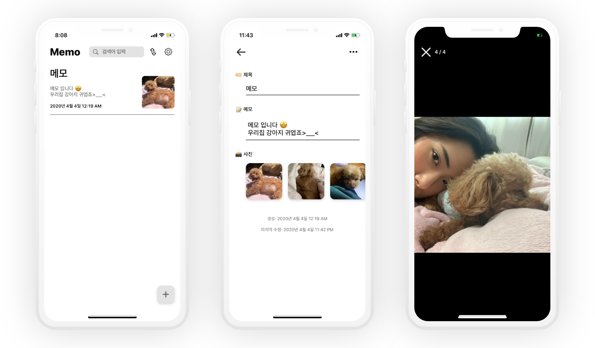
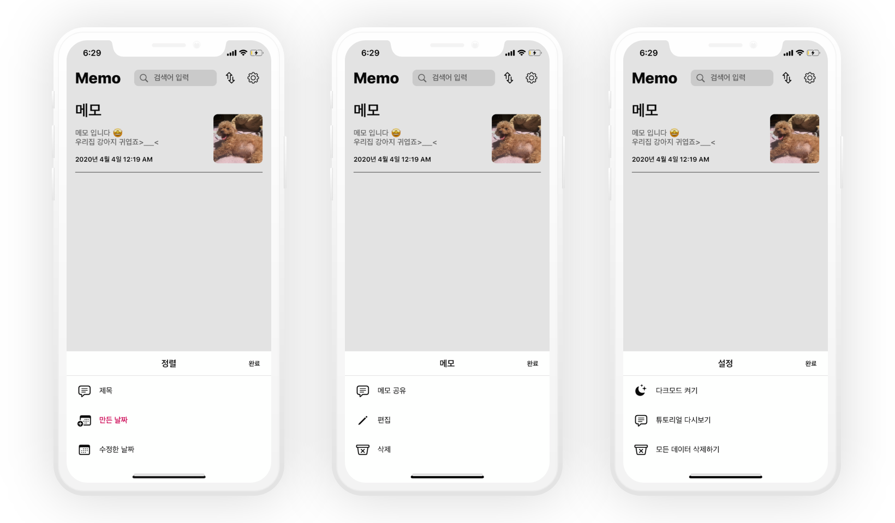

# Memo App

## Features

- [x] CoreData
- [x] 튜토리얼 화면 제공 👶
- [x] MVVM 구조로 Massive View Controller 탈출 🚀
- [x] Memo Order 기능
- [x] 쉬운 접근성을 위한 long press gesture 메모 편집 기능
- [x] 일관성있는 디자인 🙉
- [x] Dark Mode 지원 🌕 🌑
- [x] Coredata unit test 🔨
- [x] 검색 기능 제공 🕵️‍♀️

## Dependencies

- [Kingfisher](https://github.com/onevcat/Kingfisher)

- [ReactiveSwift](https://github.com/ReactiveCocoa/ReactiveSwift)

- [SnapKit](https://github.com/SnapKit/SnapKit)

## Screen ✨

 

 

 

## Any ideas..

If you have ideas for improvements, share with me or Pull Request.

## Author

Haeun Lee, haeun.developer@gmail.com
